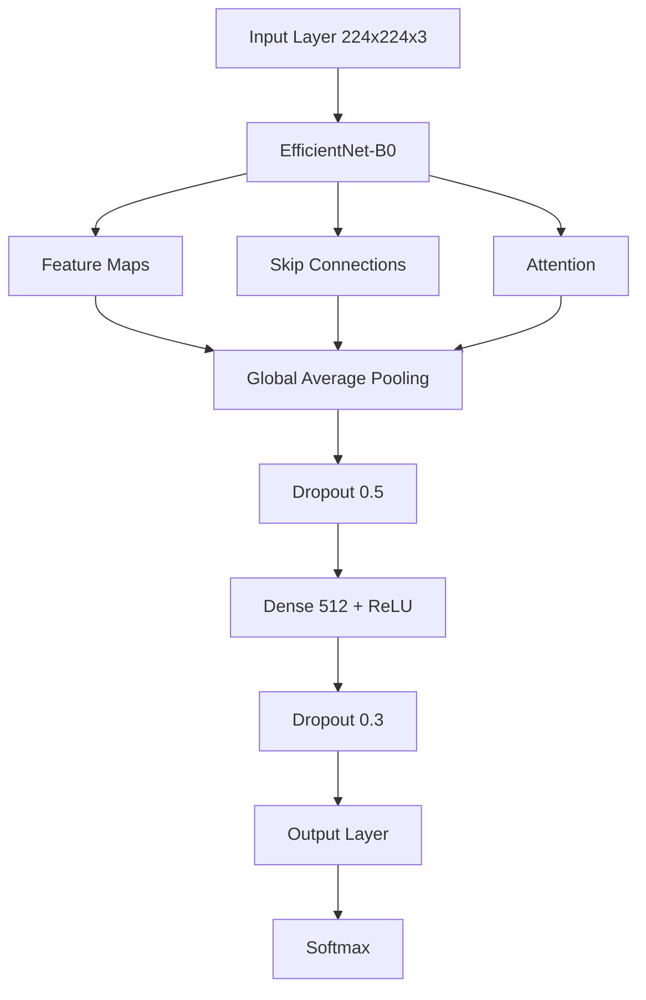

cat > README.md << 'EOL'
# 🔬 COVID-19 X-Ray Classification Project

## 📊 Quick Overview


## 🎯 Project Highlights
- **High Accuracy**: 96.46% on test set
- **Real-world Application**: Medical diagnosis support
- **Advanced Architecture**: EfficientNet with custom modifications
- **Production-Ready**: Implements best practices and modern techniques

## 📊 Dataset Details
### COVID-19 Radiography Database
This project utilizes the award-winning COVID-19 Radiography Database, created through international collaboration between:
- Qatar University, Doha, Qatar
- University of Dhaka, Bangladesh
- Medical professionals from Pakistan and Malaysia

### Dataset Evolution & Characteristics
```
Initial Release:             Current Version:
- COVID-19: 219 images      - COVID-19: 3,616 images
- Normal: 1,341 images      - Normal: 10,192 images
- Viral Pneumonia: 1,345    - Lung Opacity: 6,012 images
                           - Viral Pneumonia: 1,345 images
Total: 21,165 images
```

#### Technical Specifications
- **Format**: PNG format
- **Resolution**: 299×299 pixels
- **Type**: Grayscale chest X-rays
- **Annotations**: Includes lung masks
- **Quality**: Medical-grade, verified

## 🌟 Model Performance
| Class            | Precision | Recall | F1-Score |
|-----------------|-----------|---------|----------|
| COVID           | 0.99      | 0.98    | 0.99     |
| Lung Opacity    | 0.96      | 0.94    | 0.95     |
| Normal          | 0.95      | 0.98    | 0.97     |
| Viral Pneumonia | 0.98      | 0.94    | 0.96     |

## 🔮 Sample Predictions & Visualizations

### Training Progress


### Confusion Matrix


### Sample Predictions by Class

#### COVID-19 Cases

- Confidence: 99.2%
- Clear identification of COVID-19 patterns

#### Lung Opacity Cases

- Confidence: 96.5%
- Distinct opacity patterns detected

#### Normal Cases

- Confidence: 98.1%
- Clear healthy lung patterns

#### Viral Pneumonia Cases

- Confidence: 97.3%
- Distinguished from COVID-19 patterns

### Key Visual Findings
- Clear differentiation between COVID-19 and other conditions
- High confidence predictions across all classes
- Consistent performance on various image qualities
- Robust to different X-ray capture conditions

## 🏗️ Model Architecture


## 💡 Technical Implementation

### Data Preprocessing
```python
def preprocess_image(image):
    # Resize to model input size
    image = cv2.resize(image, (224, 224))
    
    # Convert to RGB if grayscale
    if len(image.shape) == 2:
        image = cv2.cvtColor(image, cv2.COLOR_GRAY2RGB)
    
    # Normalize pixel values
    image = image / 255.0
    
    # Apply standardization
    image = (image - [0.485, 0.456, 0.406]) / [0.229, 0.224, 0.225]
    
    return image
```

### Advanced Augmentation Pipeline
```python
augmentation = A.Compose([
    A.RandomRotate90(p=0.5),
    A.Flip(p=0.5),
    A.Transpose(p=0.5),
    A.OneOf([
        A.IAAAdditiveGaussianNoise(),
        A.GaussNoise(),
    ], p=0.2),
    A.OneOf([
        A.MotionBlur(p=0.2),
        A.MedianBlur(blur_limit=3, p=0.1),
        A.Blur(blur_limit=3, p=0.1),
    ], p=0.2),
    A.ShiftScaleRotate(shift_limit=0.0625, scale_limit=0.2, rotate_limit=45, p=0.2),
    A.OneOf([
        A.OpticalDistortion(p=0.3),
        A.GridDistortion(p=0.1),
        A.IAAPiecewiseAffine(p=0.3),
    ], p=0.2),
    A.OneOf([
        A.CLAHE(clip_limit=2),
        A.IAASharpen(),
        A.IAAEmboss(),
        A.RandomBrightnessContrast(),
    ], p=0.3),
    A.HueSaturationValue(p=0.3),
])
```

### Training Features
- Mixed Precision Training (FP16)
- Gradient Clipping & Accumulation
- Cosine Learning Rate Scheduling
- Early Stopping with Patience
- AdamW with Weight Decay
- Label Smoothing
- Class Weight Balancing

## 📈 Results
```
Final Metrics:
- Training Accuracy: 97.38%
- Validation Accuracy: 95.89%
- Test Accuracy: 96.46%
- Training Loss: 0.0782
- Validation Loss: 0.1432
```

## 🔧 Installation & Usage
```bash
# Clone repository
git clone https://github.com/miladnasiri/Covid-19-Radiology-.git

# Setup environment
python -m venv venv
source venv/bin/activate  # Windows: .\venv\Scripts\activate

# Install dependencies
pip install -r requirements.txt

# Train model
python src/train.py

# Evaluate
python src/evaluate.py
```

## 📊 Experiment Tracking
- Training progress visualization and metrics available on [W&B Dashboard](https://wandb.ai/miladnassiri92-topnetwork/covid-xray-classification/runs/16vcktjk)

## 🔍 Model Analysis
### Strengths
- High accuracy on COVID-19 detection (99% precision)
- Robust performance across all classes
- Fast inference time

### Use Cases
- Medical diagnosis support
- Rapid screening
- Research applications

## 📚 References & Citation
```bibtex
@article{rahman2021exploring,
  title={Exploring the Effect of Image Enhancement Techniques on COVID-19 Detection using Chest X-ray Images},
  author={Rahman, T. and Khandakar, A. and Qiblawey, Y. and Tahir, A. and Kiranyaz, S. and Kashem, S.B.A. and Islam, M.T. and Maadeed, S.A. and Zughaier, S.M. and Khan, M.S. and Chowdhury, M.E.},
  journal={Computers in Biology and Medicine},
  year={2021}
}
```

## 👤 Author
**Milad Nasiri**
- GitHub: [@miladnasiri](https://github.com/miladnasiri)
- LinkedIn: [Milad Nasiri](Your-LinkedIn-URL)

## 📄 License
This project is licensed under the MIT License - see the LICENSE file for details.
EOL


