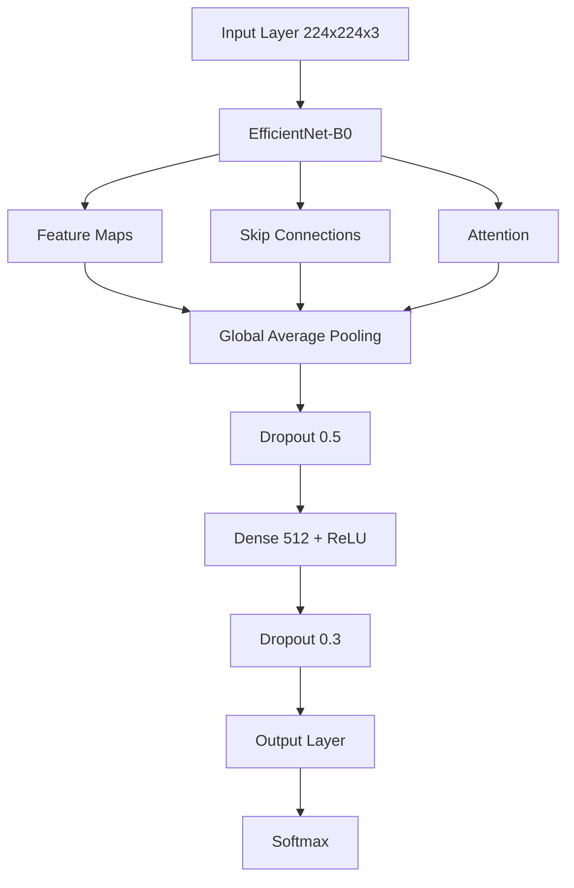

cat > README.md << 'EOL'
# 🔬 COVID-19 X-Ray Classification Project

## 📊 Quick Overview


## 🎯 Project Highlights
- **High Accuracy**: 96.46% on test set
- **Real-world Application**: Medical diagnosis support
- **Advanced Architecture**: EfficientNet with custom modifications
- **Production-Ready**: Implements best practices and modern techniques

## 🌟 Key Results
| Class            | Precision | Recall | F1-Score |
|-----------------|-----------|---------|----------|
| COVID           | 0.99      | 0.98    | 0.99     |
| Lung Opacity    | 0.96      | 0.94    | 0.95     |
| Normal          | 0.95      | 0.98    | 0.97     |
| Viral Pneumonia | 0.98      | 0.94    | 0.96     |

## 📈 Training Progress


## 🏗️ Model Architecture


## 💡 Technical Innovations
1. **Advanced Training Pipeline**
   - Mixed Precision Training (FP16)
   - Gradient Clipping & Accumulation
   - Cosine Learning Rate Scheduling
   - Early Stopping with Patience

2. **Data Augmentation Strategy**
   ```python
   Compose([
     RandomResizedCrop(224, 224),
     HorizontalFlip(p=0.5),
     RandomBrightnessContrast(),
     ShiftScaleRotate(),
     OneOf([GaussNoise(), GaussianBlur()])
   ])
   ```

3. **Optimization Techniques**
   - AdamW with Weight Decay
   - Label Smoothing
   - Class Weight Balancing
   - Mixed Precision Training

## 📊 Dataset Distribution
| Class           | Images | Percentage |
|----------------|---------|------------|
| COVID          | 3,616   | 17.1%      |
| Lung Opacity   | 6,012   | 28.4%      |
| Normal         | 10,192  | 48.2%      |
| Viral Pneumonia| 1,345   | 6.3%       |

## 🚀 Model Performance
```
Final Metrics:
- Training Accuracy: 97.38%
- Validation Accuracy: 95.89%
- Test Accuracy: 96.46%
- Training Loss: 0.0782
- Validation Loss: 0.1432
```

## 🔧 Installation & Usage
```bash
# Clone repository
git clone https://github.com/miladnasiri/Covid-19-Radiology-.git

# Setup environment
python -m venv venv
source venv/bin/activate  # Windows: .\venv\Scripts\activate

# Install dependencies
pip install -r requirements.txt

# Train model
python src/train.py

# Evaluate
python src/evaluate.py
```

## 📱 Sample Predictions


## 🧪 Experiment Tracking
- Full training logs and metrics available on [W&B Dashboard](https://wandb.ai/miladnassiri92-topnetwork/covid-xray-classification/runs/16vcktjk)

## 🔍 Model Analysis
- **Strengths**:
  - High accuracy on COVID-19 detection (99% precision)
  - Robust performance across all classes
  - Fast inference time
- **Use Cases**:
  - Medical diagnosis support
  - Rapid screening
  - Research applications

## 📚 References
1. [EfficientNet Paper](https://arxiv.org/abs/1905.11946)
2. [COVID-19 Radiography Database](https://ieee-dataport.org/documents/covid-19-chest-x-ray-database)

## 👤 Author
**Milad Nasiri**
- GitHub: [@miladnasiri](https://github.com/miladnasiri)
- LinkedIn: [Milad Nasiri](Your-LinkedIn-URL)

## 📄 License
This project is licensed under the MIT License - see the LICENSE file for details.
EOL

git add README.md
git commit -m "Enhance README with comprehensive documentation and visual elements"
git push origin main
