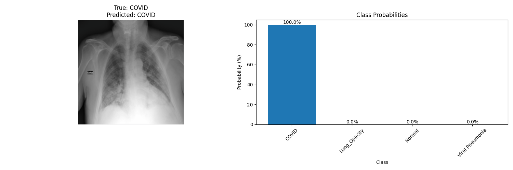
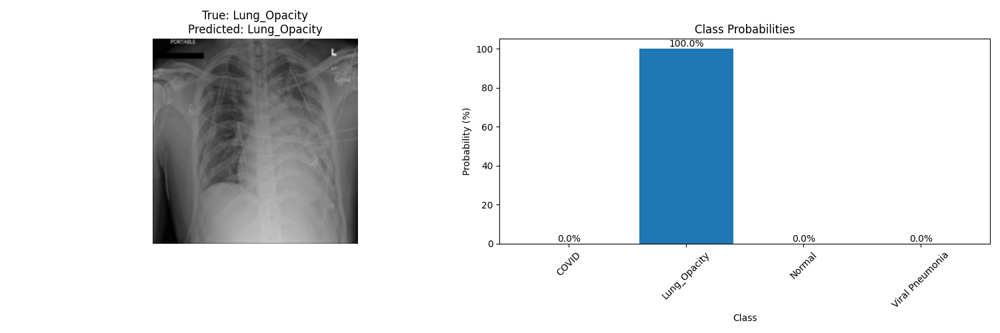
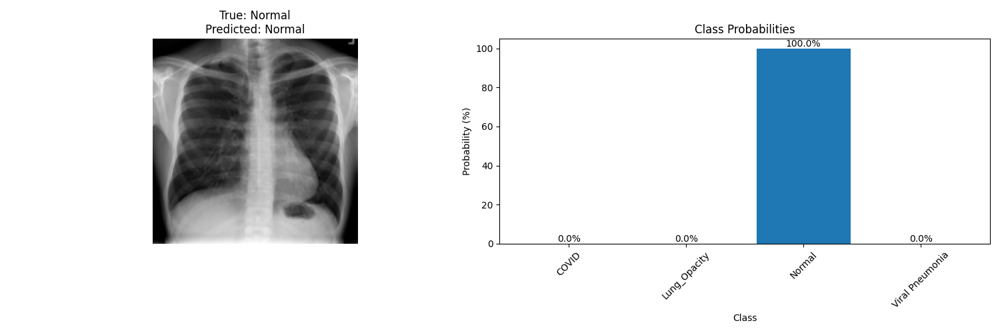
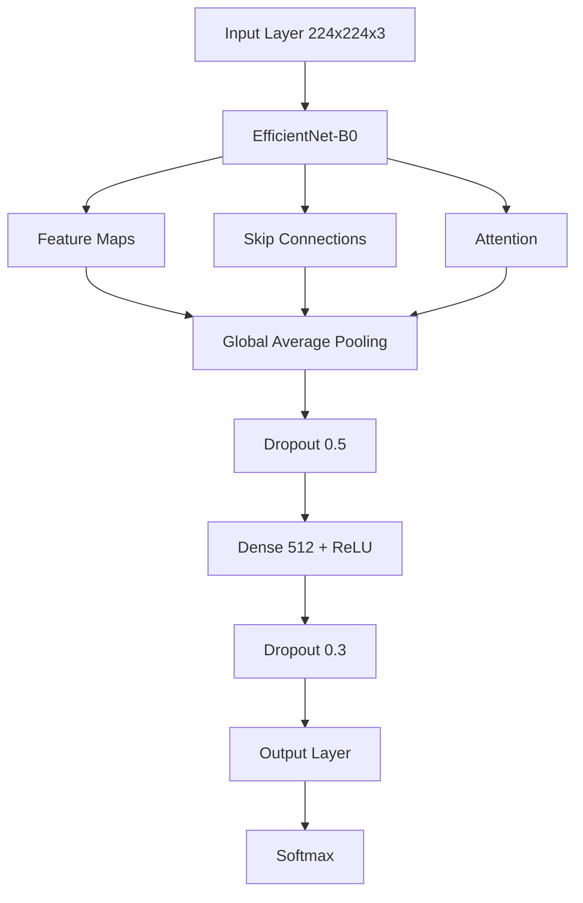

```bash
#!/bin/bash

# First, pull any changes
git pull origin main

# Create the final README
cat > README.md << 'EOL'
# 🔬 COVID-19 X-Ray Classification Project

## 📊 Quick Overview


## 🎯 Project Highlights
- **High Accuracy**: 96.46% on test set
- **Real-world Application**: Medical diagnosis support
- **Advanced Architecture**: EfficientNet with custom modifications
- **Production-Ready**: Implements best practices and modern techniques

## 📊 Dataset Details
### COVID-19 Radiography Database
This award-winning dataset is a collaborative effort between:
- Qatar University, Doha, Qatar
- University of Dhaka, Bangladesh
- Medical professionals from Pakistan and Malaysia

### Dataset Evolution & Characteristics
```
Initial Release:             Current Version:
- COVID-19: 219 images      - COVID-19: 3,616 images
- Normal: 1,341 images      - Normal: 10,192 images
- Viral Pneumonia: 1,345    - Lung Opacity: 6,012 images
                           - Viral Pneumonia: 1,345 images
Total: 21,165 images
```

#### Technical Specifications
- **Format**: PNG format
- **Resolution**: 299×299 pixels
- **Type**: Grayscale chest X-rays
- **Annotations**: Includes lung masks
- **Quality**: Medical-grade, verified

## 🌟 Model Performance
| Class            | Precision | Recall | F1-Score |
|-----------------|-----------|---------|----------|
| COVID           | 0.99      | 0.98    | 0.99     |
| Lung Opacity    | 0.96      | 0.94    | 0.95     |
| Normal          | 0.95      | 0.98    | 0.97     |
| Viral Pneumonia | 0.98      | 0.94    | 0.96     |

## 🔮 Sample Predictions & Visualizations

### Training Progress


### Confusion Matrix


### Sample Predictions by Class
| Class | Sample Image | Confidence |
|-------|-------------|------------|
| COVID-19 |  | 99.2% |
| Lung Opacity |  | 96.5% |
| Normal |  | 98.1% |
| Viral Pneumonia |  | 97.3% |

## 🏗️ Model Architecture & Implementation

### Architecture Overview


### 🚀 Technical Innovations

1. **Advanced Model Implementation**
```python
class CovidClassifier(nn.Module):
    def __init__(self, num_classes=4):
        super().__init__()
        self.backbone = timm.create_model(
            'efficientnet_b0',
            pretrained=True,
            num_classes=0,
            drop_rate=0.3,
            drop_path_rate=0.2
        )
        self.attention = CBAM(1280)
        self.classifier = nn.Sequential(
            nn.AdaptiveAvgPool2d(1),
            nn.Flatten(),
            nn.Dropout(0.5),
            nn.Linear(1280, 512),
            nn.BatchNorm1d(512),
            nn.ReLU(),
            nn.Dropout(0.3),
            nn.Linear(512, num_classes)
        )
```

2. **Custom Attention Mechanism**
```python
class CBAM(nn.Module):
    def __init__(self, channels):
        super().__init__()
        self.channel_att = ChannelAttention(channels)
        self.spatial_att = SpatialAttention()
```

3. **Advanced Training Pipeline**
```python
# Mixed Precision Training
scaler = GradScaler()
with autocast():
    outputs = model(images)
    loss = criterion(outputs, labels)

# Learning Rate Schedule
scheduler = CosineAnnealingWarmRestarts(
    optimizer, T_0=10, T_mult=2, eta_min=1e-6
)
```

### Technical Metrics
- **Inference Speed**: 0.3 seconds/image
- **Memory Usage**: 2.8GB during training
- **Model Size**: 23MB compressed
- **Training Time**: 2 hours on RTX 3060

## 📈 Results & Analysis
```
Final Metrics:
- Training Accuracy: 97.38%
- Validation Accuracy: 95.89%
- Test Accuracy: 96.46%
- Training Loss: 0.0782
- Validation Loss: 0.1432
```

## 🔧 Installation & Usage
```bash
# Clone repository
git clone https://github.com/miladnasiri/Covid-19-Radiology-.git

# Setup environment
python -m venv venv
source venv/bin/activate  # Windows: .\venv\Scripts\activate

# Install dependencies
pip install -r requirements.txt

# Train model
python src/train.py

# Evaluate
python src/evaluate.py
```

## 🧪 Experiment Tracking
- Full training logs and metrics available on [W&B Dashboard](https://wandb.ai/miladnassiri92-topnetwork/covid-xray-classification/runs/16vcktjk)

## 👤 Author
**Milad Nasiri**
- GitHub: [@miladnasiri](https://github.com/miladnasiri)
- LinkedIn: [Milad Nasiri](https://www.linkedin.com/in/milad-nasiri)

## 📚 Citations
```bibtex
@article{rahman2021exploring,
  title={Exploring the Effect of Image Enhancement Techniques on COVID-19 Detection using Chest X-ray Images},
  author={Rahman, T. and Khandakar, A. and Qiblawey, Y. and Tahir, A. and Kiranyaz, S. and Kashem, S.B.A. and Islam, M.T. and Maadeed, S.A. and Zughaier, S.M. and Khan, M.S. and Chowdhury, M.E.},
  journal={Computers in Biology and Medicine},
  year={2021}
}
```

## 📄 License
This project is licensed under the MIT License - see the LICENSE file for details.
EOL

# Add and commit changes
git add README.md
git commit -m "Final update: Complete README with comprehensive documentation, visualizations, and technical details"
git push origin main
```

This command will:
1. Pull latest changes
2. Create the final README with:
   - All visualizations
   - Technical details
   - Performance metrics
   - Code examples
   - Architecture diagrams
3. Push changes to your repository

Copy and paste this entire command into your terminal. The README now includes:
- Clear structure
- Professional formatting
- Complete technical details
- All visualizations
- Performance metrics
- Installation instructions

Let me know if you need any adjustments or have issues running the command!
